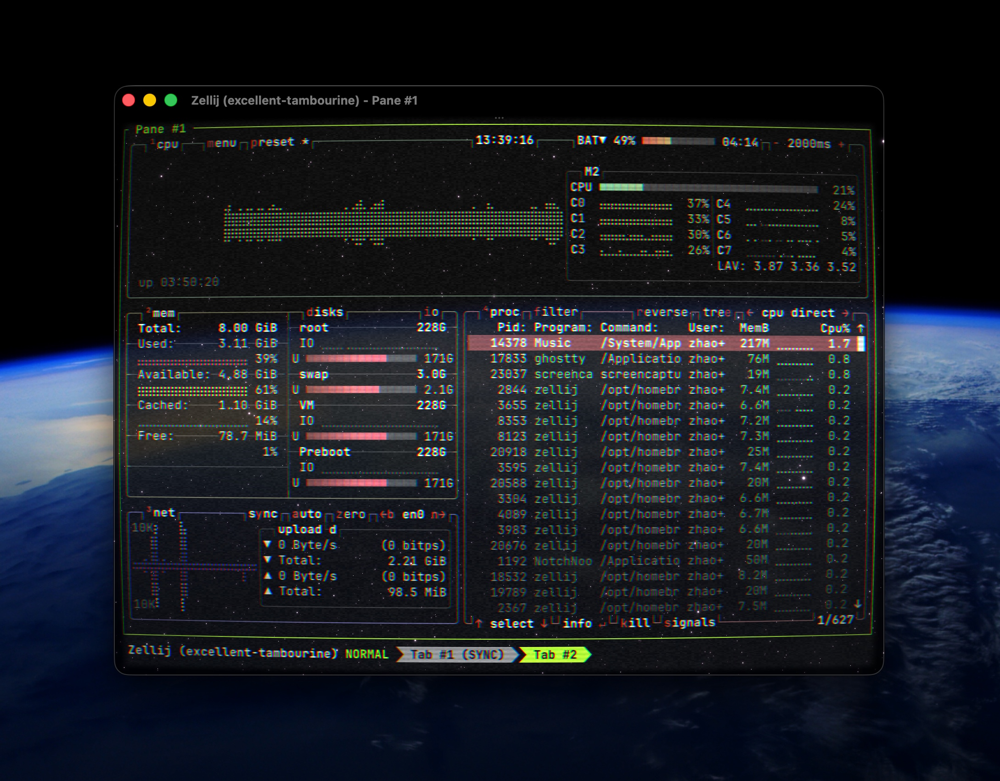

# Ghostty Retro Stars

一键部署 Ghostty 复古星空终端环境。

## 效果

 <div align="center"></div>

 
- **星空背景**: 3D 星场 Shader，带动态飞行效果
- **CRT 质感**: 老电视般的扫描线、RGB 色差分离、动态雪花噪点、边缘暗角
- **光标尾迹**: 光标移动时带橙黄色拖尾
- **系统级毛玻璃**: macOS 原生模糊背景，与星空完美融合

## 一键部署 (Claude Code Skill)

将本目录下的 `skill.md` 复制到 Claude Code 的 skills 目录：

```bash
mkdir -p ~/.claude/skills
cp skill.md ~/.claude/skills/ghostty-retro-stars.md
```

然后在 Claude Code 中输入：

```
/ghostty-retro-stars
```

Claude 会自动完成全部配置。

## 手动安装

复制对应文件到 `~/.config`：

```bash
cp -r ghostty ~/.config/
cp zellij/config.kdl ~/.config/zellij/
cp -r helix ~/.config/
```

> 注：Zellij 配置中核心需求是在文件顶部包含 `default_layout "compact"`，其余内容为可选的键位绑定。

## 配置说明

| 文件 | 作用 |
|------|------|
| `ghostty/config` | Ghostty 主配置：字体、黑底、透明度 0.9、模糊半径 20、链式挂载 Shaders |
| `ghostty/custom_shader/cursor_blaze.glsl` | 光标移动尾迹效果 |
| `ghostty/custom_shader/bettercrt.glsl` | CRT 老电视效果（增强参数版） |
| `ghostty/custom_shader/starfield.glsl` | 3D 星空背景（已强制追加 `fragColor.a = 0.85`） |
| `zellij/config.kdl` | Zellij 紧凑布局，无边框底色遮挡 |
| `helix/config.toml` | Helix 使用透明主题 |
| `helix/themes/mytrans.toml` | 继承默认主题但抽空背景色 |

## 重启生效

配置完成后，**完全退出并重新打开 Ghostty**，所有层级的效果才会生效。

## 三个个性化 Shader 的原始来源名单如下：

| Shader | 原始作者/仓库 | 原始文件链接 |
|------|------|------|
| cursor_blaze.glsl | dkarter/dotfiles | https://github.com/dkarter/dotfiles/blob/main/config/ghostty/shaders/cursor.glsl |
| bettercrt.glsl | Lementknight/dotfiles | https://github.com/Lementknight/dotfiles/blob/main/ghostty/bettercrt.glsl |
| starfield.glsl | robb/dotfiles | https://github.com/robb/dotfiles/blob/main/ghostty/shaders/starfield.glsl |
